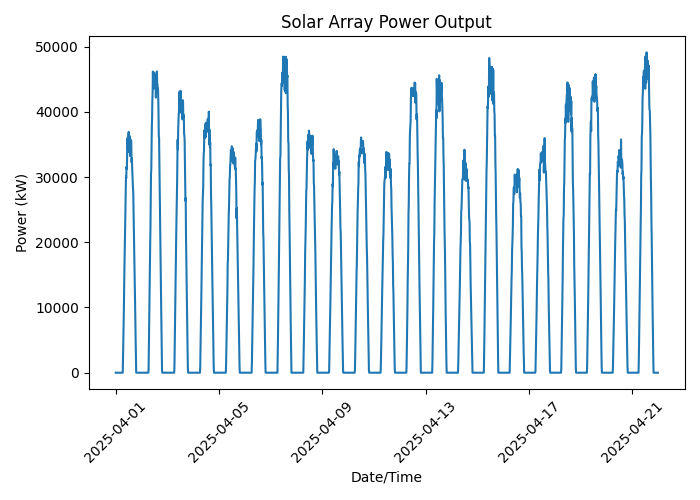

# Power Monitor #
Analyze a three-week dataset of power output from a sample solar array [powermon.csv](https://github.com/prof-tallman/codepuzzles/tree/main/engineering/powermon/powermon.csv). Parse and process the data to calculate summary statistics, generate a report, and create a plot.

## Rankings ##
These stages are friendly suggestions to help new programmers. Skilled students may complete the project in any order and might find better ways to meet the requirements.

1. ***AI Does My HW***:  
   Read a CSV file and print the first few data rows.
   - The CSV will have a header row and then one row per daily observation.
   - Open the file, read all lines, split each row on commas, and strip any whitespace.
   - Store the result in a list of tuples (data), where each tuple represents one row from the CSV file.
   - Print the first 5 rows (and the header) to confirm that the parsing code worked.
   ```
   user@computer:~$ python powermon.py
   2025-01-01 06:00 -> 0 W
   2025-01-01 06:15 -> 1200 W
   2025-01-01 06:30 -> 3500 W
   2025-01-01 06:45 -> 5200 W
   2025-01-01 07:00 -> 7400 W
   ```
   
2. ***Script Kiddie***:  
   Extract and print basic statistics for the `Power` column.
   - Each power reading is given in kW and is the average output for a 15 minute interval.
   - Read every row and convert the `Power` values from strings to numbers.
   - Manually compute some basic statistics, avoiding any pre-existing statistics modules.
     - Minimum value
     - Maximum value
     - Mean value (rounded to 0 decimal places)
     - Range of values
   - Print the results in a readable format.
   ```
   user@computer:~$ python powermon.py
   Power statistics:
     Min:   0 kW
     Max:   48200 kW
     Mean:  15210 kW
     Range: 48200 kW
   ```

3. ***Professional***:  
   Generate a power monitoring report to help engineers understand power plant health and performance.
   - Print the start and end date for the power measurements.
   - Calculate the total energy produced over the past 10 days in kilowatt-hours (kWh).
   - Extrapolate the change in power output over the last 15 minutes using the most recent two measurements, report the ramp rate in kW/hour. Always report a positive number, but explain whether production is increasing, decreasing, or holding steady.
   - Use position-based command line parameters to specify the name of the file. Assume that any other data files provided by the user will follow the same structure/format as the sample file.
   ```
   user@computer:~$ python powermon.py powermon.csv
   Solar output from 2025-01-01 06:00 to 2025-01-21 20:00
   ======================================================
     Min:   0 W
     Max:   48,200 kW
     Mean:  15,400 kW
     Range: 48,700 kW
   Over the past 10 days, 14,253,152.5 kWh have been generated
   The plant is currently outputting 10,540 kW and dropping at 1200 kW/hr
   ```
   
4. ***1337 H@cker***:  
   Plot a graph that shows the power output over the time period contained in the file.
   - Add a title and label the axis appropriately
   - Scale the axis for the data in the file (most graphing libraries will do this automatically)
   - Avoid cluttering the graph with unnecessary features
   - Save the plot as poweroutput.png in the current directory
   - Display the graph to the screen.


5. ***BONUS***:  
   Predicts the power output for the next week using linear regression.
   - Manually calculate the line for the linear regression
   - Plot the linear regression for 24 hours into the future.

## AI Restriction ##
Students may use AI to look up:
- How to open and read CSV files
- How to parse strings into integers or floats
- Unit conversions and statistical algorithms
- How to format numbers or strings for printing
- How to use common graph/plot libraries (for the final stage)

Students may not share the project description or ask AI to write the complete solution. Asking the AI to connect individual concepts is also prohibited.

## Constraints ##
This project has a number of important details that must be followed.
- All numeric calculations for stages 1–4 must be coded manually, by iterating over the dataset. No statistics or data-analysis libraries are allowed (but rest assured, they exist... for future projects).
- Datetime values in the CSV file are formatted according to the `YYYY-MM-DD HH:MM` format (24-hour time).
- The `Power` column contains numeric values in kilowatts (kW).
- Power readings are reported every 15 minutes, an important fact for several of the calculations.
- Output should be human-readable, show units, and be neatly aligned.
- Use common plotting libraries to handle all graphics (but no additional analysis libraries). A common module for Python is called Matplotlib.

## Resources ##
Power dataset to use for this project: [powermon.csv](https://github.com/prof-tallman/codepuzzles/tree/main/engineering/powermon/powermon.csv). The data for this project was generated by ChatGPT on August 16th 2025. Several unnecessary columns were removed from the sample data.
