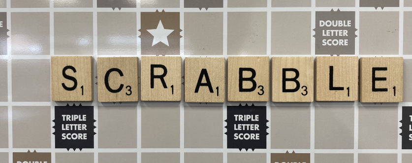

# Scrabble Word Suggestion #
Calculate all the possible Scrabble words that fit on a partially formed Scrabble board. For example, if a Scrabble Board contains the letters `M` and `U` with an empty space between them, the word "coMpUter" and "ruMoUred" both fit, along with some other words. The program should output a list of all the valid words.

## Constraints ##
The code should be implemented as a publicly available function. Wrap the function in a small program that allows users to query the function from the command line.
* Users specify the puzzle using fixed letters and underscores to represent wildcards (i.e., "uni___s_ty")
* Players are restricted to a maximum of 7 Scrabble tiles, so the input must be limited to 7 underscores or less
* If a particular puzzle contains no valid words, return an empty list
* Each programming language has some form of a list of array, use whichever data structure is appropriate for the programming language
* Enforce the standard Scrabble tile counts (e.g., there are four 'U' tiles and, two 'V' tiles, one 'X' tile, etc)

## Examples ##
Here are three sample runs that show all of the possible valid words.
* Input: `__rn__in_` Output: `['carnitine', 'carnosine', 'cornering', 'cornicing', 'cornutine', 'cornuting', 'furnacing', 'garnering', 'hgrnotine', 'hornotine', 'kerneling', 'surnaming', 'turnicine']`
* Input: `_q_z_` Output: `[]`
* Input: `abc____` Output: `['abcissa']`
* Input: `puz___` Output: `['puzzle']` (the word "puzzle" requires two Zs but the game only includes 1 'Z' tile... however, the wildcard tile can cover the second 'Z')

## Resources ##
The Scrabble Word Score Calculator will need a list of approved words to verify user input. The official Scrabble dictionary is available to members of the North American Scrabble Players Association (NASPA) as a text file; however, it is not released to the public. Therefore, this project will use a publically available dictionary obtained from DWYL's github repository. DWYL posted a text file containing 479k English words based on a file from Info Chimps. **Warning:** there are "words" in this file that are obviously not real words... but it's a reasonable dictionary in the public domain.
* [words_alpha.txt](words_alpha.txt)
